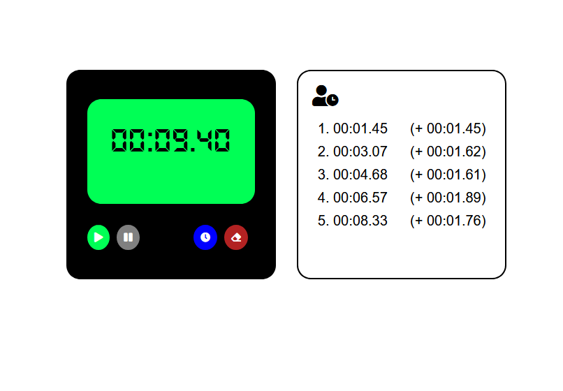

# Calculatrice avancée

[Voir la démo](https://virginiebouvarel.github.io/calculator/)

Pour ce projet mon objectif était de réaliser une calculatrice from scratch sans suivre de tuto ou de consignes. 
Je souhaitais aller un peu plus loin que les exemples habituels de calculette ne gérant que les opérations basiques. 
Je voulais rendre le projet plus intéressant en essayant de me rapprocher le plus possible des fonctionnalités présentées par les calculettes de nos téléphones portables.
Les points techniques qui m'ont demandé le plus de réflexion concernent l'organisation du code: comment concilier d'une part l'affichage pour un oeil humain et la logique de calcul par ailleurs, parvenir également à concevoir suffisemment clairement le déroulé d'une opération pour en faire une implémentation correcte, et parvenir à intégrer la gestion des nombres négatifs (auxquels je n'avais pas du tout pensé au départ! merci à mes crashtesteurs ;)) sans casser le reste de la logique.

> Série: No Tuto

> Technos: HTML/CSS/JAVASCRIPT

Fonctionnalités | Done
----------------|------
Layout flexbox |✔️
Affichage d'opérations sur plusieurs lignes | ✔️
Verrouillage des saisies non autorisées | ✔️
Gestion des edge cases pour l'affichage | ✔️
Suppression du dernier caractère saisi | ✔️
Remise à zéro de l'affichage | ✔️
Gestion des opérations successives | ✔️
Gestion de la précédence des opérateurs | ✔️
Gestion de la division par zéro | ✔️
Gestion des nombres relatifs | ✔️
Majorations et minorations en pourcentages | ✔️

