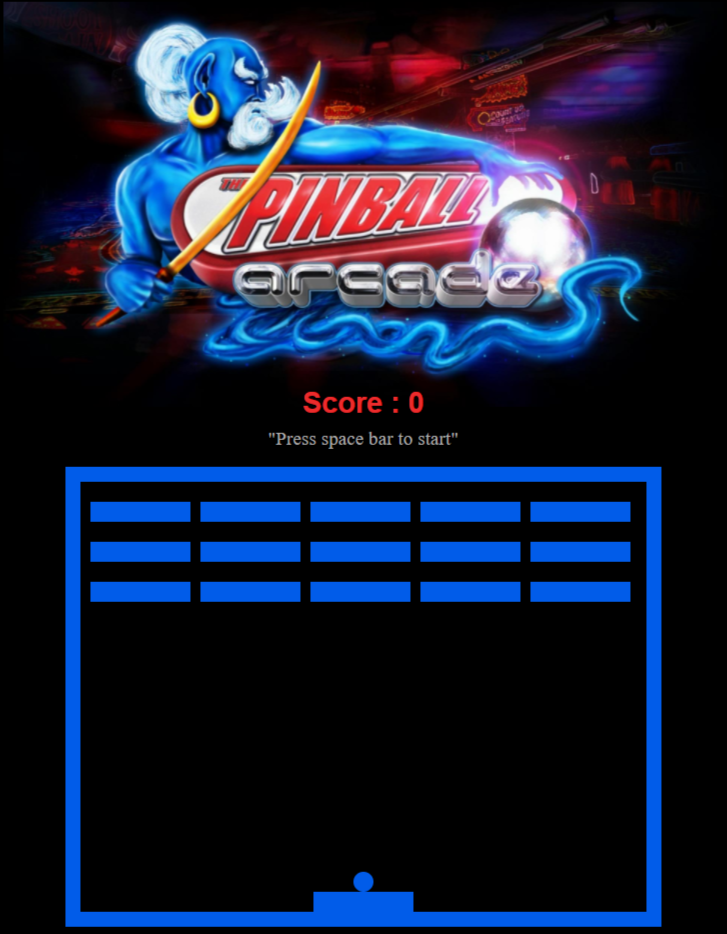

### Live version [here](http://breakout.virginiebouvarel.fr ).

# Pinball Breakout

  

## Détails

> Technos utilisées : HTML/CSS/JS
> Outils : mixkit.co pour les sons

Pour ce projet mon objectif était de réaliser un jeu de casse-briques complet.
A partir du projet pong réalisé en amont j'ai complètement repris la structure du code afin de tout implémenter en classes ES6 et ajouté les fonctionnalités nécessaires à la gestion des briques.
Mon défi technique le plus important a été au niveau de l'architecture logicielle, parvenir à créer les bonnes classes et à placer la logique au bon endroit m'a permis de mieux cerner les principes de l'orienté objet en javascript.

Avec ce challenge j'ai appris...
- qu'une classe devait s'occuper d'elle-même pour éviter la multiplication des dépendances
- qu'on "ne parle pas aux inconnus mais seulement aux amis" (Loi de Déméter)
- que la conception d'un projet au niveau architectural est compliquée mais passionante

