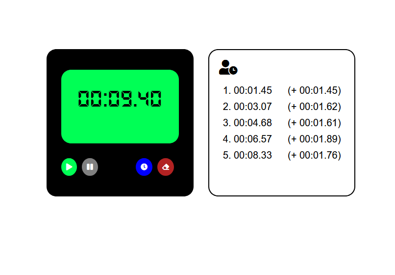

### Live version [here](https://virginiebouvarel.github.io/projets_perso/chronometer/).

# Chronomètre

## Détails

> Technos utilisées : HTML/CSS/JS

Pour ce projet mon objectif était de réaliser un simple chronomètre mais vraiment from scratch sans suivre de tuto ou de consignes. 
Mon défi technique le plus important a été justement de passer ce cap, je suis restée pas mal de temps dans l'inertie avant de parvenir à écrire les premières lignes de codes ou à tracer les premières représentations visuelles de ce petit chrono.
Le rendu n'est pas extraordinaire mais l'objectif est atteint, j'ai crée qelquechose de a à z et ça fonctionne.  

Fonctionnalités:
- START: Déclenchement du compteur, avec rafraîchissement de l'affichage tous les centièmes de seconde
- STOP: Arrêt du compteur
- SPLIT: Affichage du temps courant et calcul de l'écart avec le temps précédent
- RESET: Remise à zéro de l'affichage et du compteur   

Avec ce challenge j'ai appris...
- que mes 2 bootcamps m'avaient seulement fait survoler beaucoup de choses
- à passer le cap du from scratch et à me faire confiance pour réaliser un projet selon mon idée

