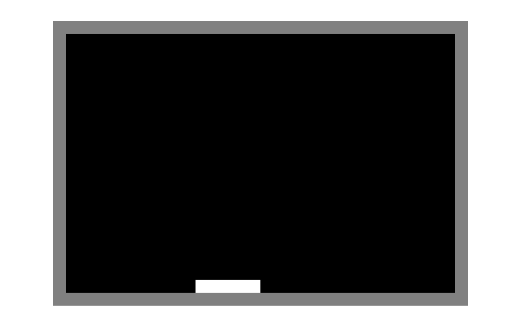

### Live version [here](https://virginiebouvarel.github.io/projets_perso/paddle/).

# Paddle avec mouvements au clavier et à la souris

## Détails

> Technos utilisées : HTML/CSS/JS

Pour ce projet mon objectif était de relever le challenge que le youtubeur [benjaminCode](https://www.youtube.com/channel/UCLOAPb7ATQUs_nDs9ViLcMw) m'avait lancé. A la sortie de ma 2e formation en bootcamp j'ai contacté Benjamin pour lui demander des conseils et son idée sur le niveau que doit avoir un junior pour être réellement opérationnel et ainsi ne pas peser sur l'équipe qui l'accueillera et qui aura misé sur lui. Mon premier mail, envoyé un peu comme une bouteille à la mer a non seulement obtenu une réponse mais Benjamin a réalisé dans la foulée une [vidéo](https://www.youtube.com/watch?v=XJYRhQUjS6I) particulièrement intéressante sur le sujet. Ce petit projet, réalisé très facilement,  m'a permis de constater que j'étais sur la bonne voie et qu'il n'y avait qu'à poursuivre.  

Avec ce projet j'ai appris...
- que je voulais aller trop vite et que je devais reparcourir tout le chemin à mon rythme pour asseoir mes compétences acquises
- que la reconversion isole et qu'il faut se trouver des collègues de bureau "virtuels"
- que j'étais loin d'être mauvaise même si le chemin allait être plus long que prévu
- qu'au final, je ne souhaitais pas que ce chemin fait de journées de code, de découverte de nouvelles technos, de nouvelles bonnes pratiques ou tips prennent fin un jour 😀