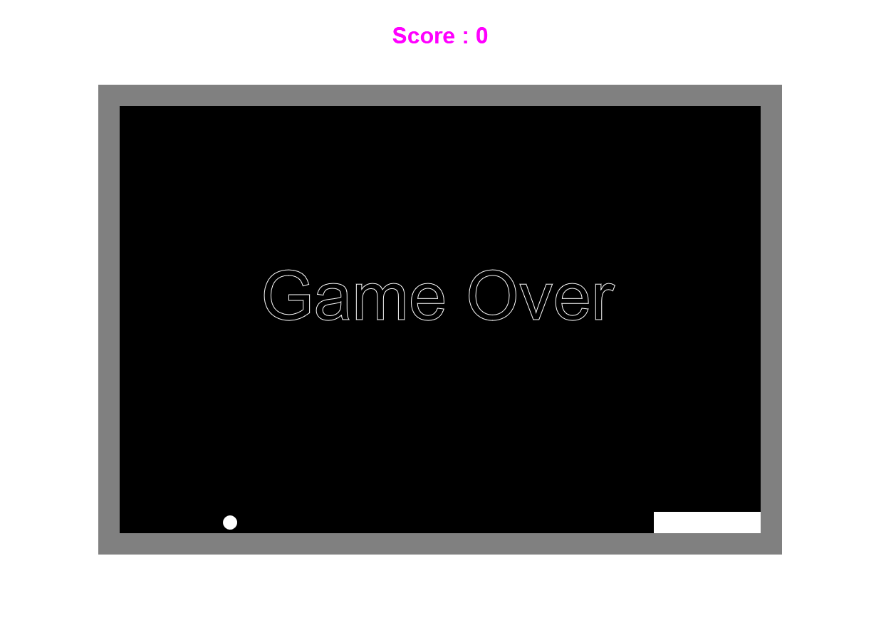

### Live version [here](https://virginiebouvarel.github.io/projets_perso/pong/).

# Jeu de pong

## Détails

> Technos utilisées : HTML/CSS/JS

Pour ce projet mon objectif était de réaliser un jeu de pong comme étape préliminaire à la conception d'un jeu de casse briques plus complet. J'ai procédé par étapes en créant d'abord un canvas et un rectangle pour le paddle que j'ai fait bouger en implémentant les fonctions nécessaires pour une interaction au clavier comme à la souris. Après quoi j'ai ajouté la balle et ses déplacements ainsi que toute la logique pour les collisions.
Les deux challenges techniques ici ont été tout d'abord d'arriver à concevoir un mouvement à l'aide du code. 
Comment représenter un déplacement? En utilisant des coordonnées x et y comment déterminer une trajectoire? 
Puis j'ai découvert l'utilisation de requestAnimationFrame() et de ses subtilités, afin de rendre mon animation plus fluide.  

Avec ce challenge j'ai appris...
- à faire bouger un élément en fonction des commandes de l'utilisateur ou de manière autonome
- à redécouvrir l'utilisation d'un canvas
- à concevoir un déplacement en modifiant les coordonnées d'un élément sur l'axe des absisses ou des ordonnées

