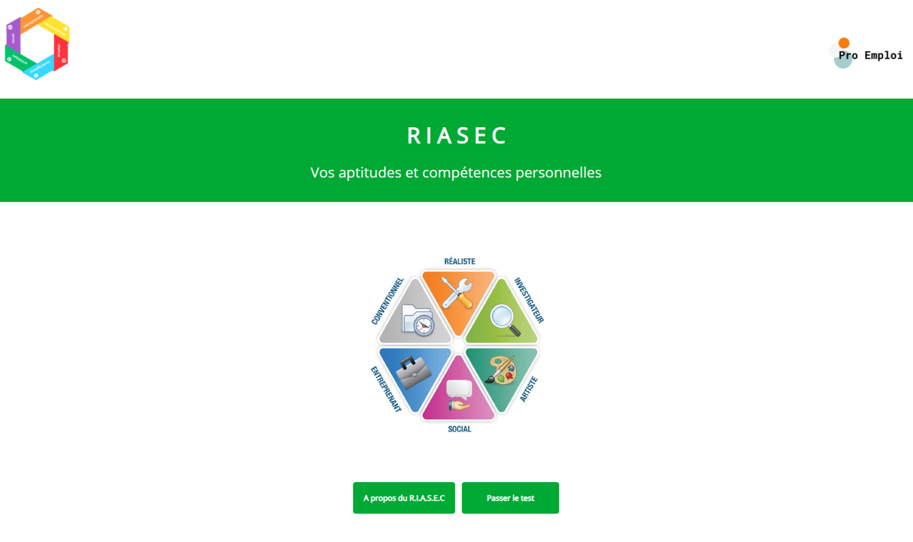
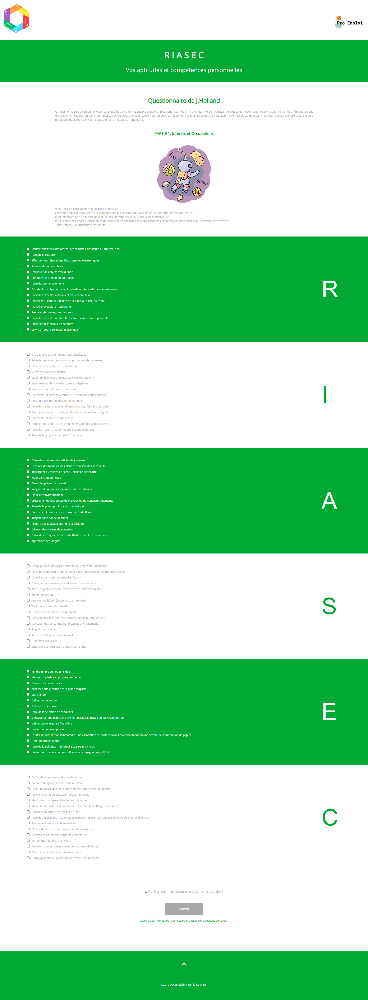
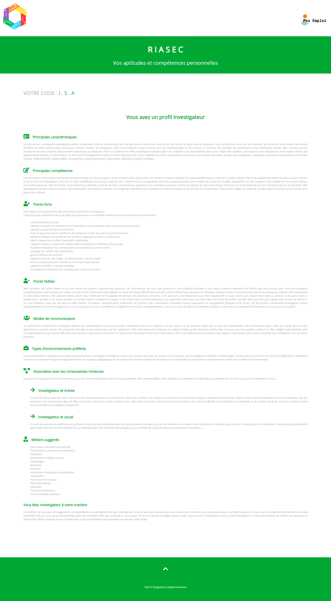
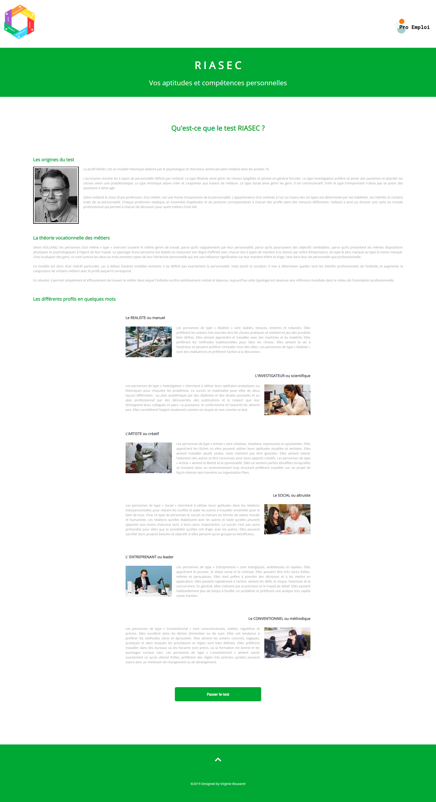
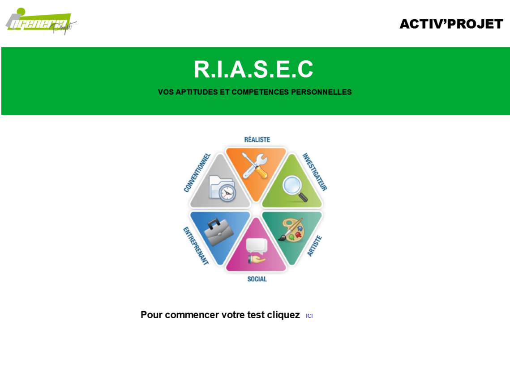
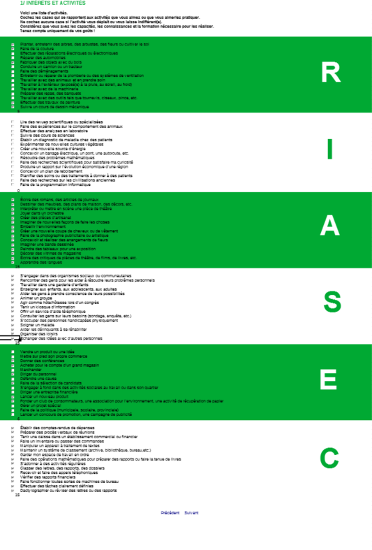
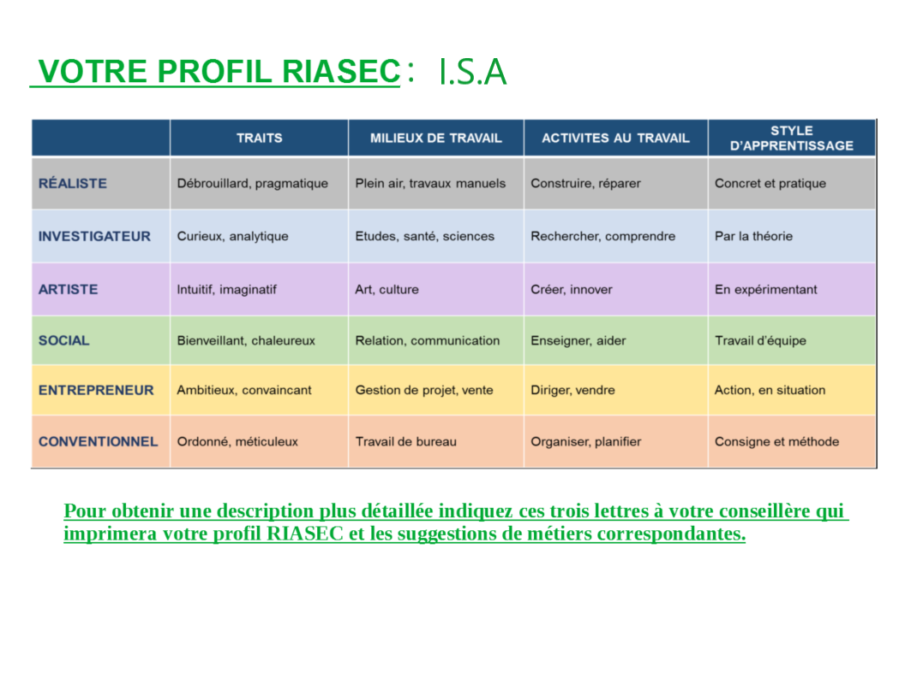

### Live version [here](http://riasec.virginiebouvarel.fr).

# RIASEC

## Détails

> Technos utilisées : HTML5/CSS3/JS/PHP/MySQL

Le R.I.A.S.E.C est un test de personnalité professionnelle que j'utilisais avant ma reconversion lors de bilans de compétences.
Mes collègues et moi n'avions qu'une version papier fastidieuse à expliquer à nos bénéficiaires. 
A l'époque j'ai réalisé une version excel avec macros automatiques sur mon temps personnel (en fait il s'agissaitt d'une version libreoffice/calc, seul logiciel à ma disposition à ce moment là et que je ne connaissais pas du tout, mais heureusement à l'époque google était déjà mon ami 😊). Puis, après ma formation aux bases du développement web, j'ai réalisé une version plus aboutie de manière à ce que mes collègues puissent s'en servir au quotidien.

Cette version a été réalisée sans aucun framework afin de respecter une consigne imposée dans le cadre de l'obtention du titre RNCP de développeur web et intégrateur.  

Avec ce projet j'ai appris...
- à concevoir et réaliser mon tout premier site web complet et fonctionnel
- à faire travailler javascript et php ensemble
- à gérer la sécurisation des saisies utilisateurs 
- à interroger (et réinterroger 😉) les besoins métiers pour concevoir un produit adéquate
- à penser moi-même le design d'un site
  

## Quelques exemples de page
 

  

  
## Et pour le fun les copies d'écrans de la version calc 😉
 

\
\

